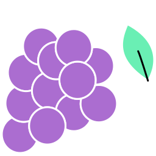

# Grape - GTK Extension Library

<div align="center">
    
</div>

## What is it
Grape is a GTK extension and widget library written in TypeScript using GJS, designed to enhance the development of GNOME applications.

## Features

- **TypeScript Advantage:** Leverage the powerful features of TypeScript to write more reliable and maintainable GTK applications.
- **Custom Widgets:** Extend your applications with a suite of custom widgets specifically designed for the GNOME desktop environment.
- **Easy Integration:** Seamlessly integrate Grape into your existing GTK projects with minimal setup.
- **GJS Compatibility:** Fully compatible with GJS, allowing for easy integration with GNOME applications.

## Getting Started

### Prerequisites

Before you begin, ensure you have the following installed:

- GNOME (with GJS)
- TypeScript
- Node.js and npm

### Installation

Clone the Grape repository:

```bash
git clone https://github.com/yourusername/grape.git
```

Navigate to the Grape directory:
```bash
cd grape
```

Install dependencies:
```bash
npm install
```

Compile TypeScript to JavaScript:
```bash
tsc
```

### Usage

To use Grape in your GJS application, import the compiled JavaScript files into your project. Here's a simple example:

```typescript
const Grape = imports.gi.Grape;

// Initialize your application
const App = new Grape.Application();

// Use Grape's widgets and utilities
const GrapeButton = new Grape.Button(
    outlined: true,
    disabled: false,
    label: 'Click Me',
    size: ButtonSize.Large,
);

App.addWidget(GrapeButton);

// Run your application
App.run();
```

### Contributing
Contributions to Grape are highly encouraged! If you'd like to contribute, please fork the repository and submit a pull request with your changes. For more details, check out our contributing guidelines.

### License
Grape is released under the MIT License. For more information, see the LICENSE file in the repository.

For detailed documentation and further examples, please refer to our Wiki. For support, please open an Issue.